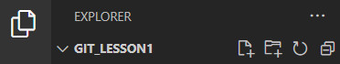

>**This is ia quick user guide for beginners to basics of Git. It is a live document and it being updated regularly**

 

# About Git

Git is one of the most popular solutions in market for managing the versions of files in complex projects, whether performed by one person or multiple team members. 

A few examples where the control of versions is needed: 

1. You created a website and it works just fine. However, you decide to add some new features to this site. If new feature corrupts the current version of website, you have problems. But if you saved your current version prior to adding new feature and if you can go back to saved version, then you are ok.
2. You completed a work on a big document and you are happy with it. At the last moment you made some changes to the document that you don't like. If you have means to go back to your saved version of document, you don't have to re-write the entire document.
3. There is a shared document in a project to which several members of the project can have simultaneous editing access. To avoid situation where a work of one member uncontrollably supersedes a work of the others, all versions of the document need to be controlled.

 

# Download and install

Download and install the latest version of Git use the following link: 
> [Download Git](https://git-scm.com/downloads)

 

While it is possible to manage a project through Git interface itself, it is not convenient, that's why there are many other applications that are used as console/terminal for Git. Visual Studio Code is one of the most popular ones.

Download and install the latest version of Git use the following link: 
> [Download Visual Studio Code](https://code.visualstudio.com/download)

 

>**Note:** It is recommended to install Git first, followed by VSC. 

 

# Start

## Create and open project folder

Once Git and VSC are installed, create a folder on your PC or remote location where your project will reside and where your repository will be. After that open the folder that you have created via VSC by clicking the second icon in Explorer, as depicted in below image, or click *File/Open Folder...* in *Menu* tab of the program.

 

>**Note:** Avoid using cyrilic letter in a path name to your folder

 

## Initialize

>**Note:** Repository is not exactly the same thing as a folder with project files. Repository is a place where Git performs tracking of all changes in the project and controls them. While it is in the same place as the project folder, it is not created automatically when you create the folder. You need to initiate it using a command.

 - *git init* - a command that creates a Git repository

Once repository is created, you can start creating files in it and work on them.

At some point after creation of repository the program will ask you to introduce yourself.
Commands that and information that you will need to provide is as follows:
- *git config --global user.name < name >*
- *git config --global user.email < email address >*

 

# Begin to work

## Create files and start working on project

To create a new file in repository just click on the first icon in Explorer or click *File/New File..." in *Menu* tab of the program.

 

## Checking status or work

*git status* is one of most commonly used commands for working with Git. As name of the command suggests, it allows to see if there is anything that needs your attention.
Use this command before and after any changes you make to Git (add, commit, checkou, etc).
When typed *git status* command pay attention to the following information that might be displayed in Terminal:

|Status of work| Desciption|
|----------|-----------|
|*Untracked, new file, modified*| - statuses of files that are due for commit
|*Changes not staged for commit*| - status of changes that are not ready yet for commit
|*Changes to be commited*| - status of changes that are ready for commit, have been staged

 

The list of most common commands for checking the status of work, the history of commits, etc. are as follows:

|Command| Desciption|
|-------------|-----------|
|*git status*| - shows which branch you are on and whether there are any changes to project that are due for saving/commit
|*git log*| - shows the list of commits created (if any) previously
|*git log* --graph| - same function as above but with graphical representation of branches
|*git diff ##*| - checking the differences between the last two commits
|git diff < commit "a" hash > < commit "b" hash >| - checking the differences between selected two commits

>Note: If a list of information to display in Terminal after entering the command **git log** is extensive, Terminal might show just sigle cursor or the word **END** on the bottom most line. Just press letter **q** on the keyboard to exit to normal view. 
>>Beware of keyboard language layout. If it is not **English**, pressing **q** won't work.

 - cursor 

 - end

 

## Save changes to project

## Branches - create, delete, merge, move between
Branch is a feature which allows you to work on different areas of project independently. For instance, you might want to continue main work on the project while at the same time develop a feature of the project which, if succeeds, will be merged with main project in future.

Here are the commmands that can be used for branches:
## Merge branches

Full list of commands to cover in this document:

|Command| Desciption|
|----------|-----------|
|git status| Checks the status
|git add < file_name >| Stages a file for next commit
|git add .| 
|git commit -m "< comment >"|
|git commit -am "< comment >"|
|git log|
|git diff ##|
|git diff < commit "a" hash > < commit "b" hash >|
|clear|
|git branch|
|git branch < branch name >|
|git branch -d < branch name >| **small d**
|git checkout < branch or commit hash >|
|git merge < branch name >| merge to be done from branch *into* which merge will be done. For instance, if you want merged information to be in branch "a", then make sure you are in this branch and then type merge

